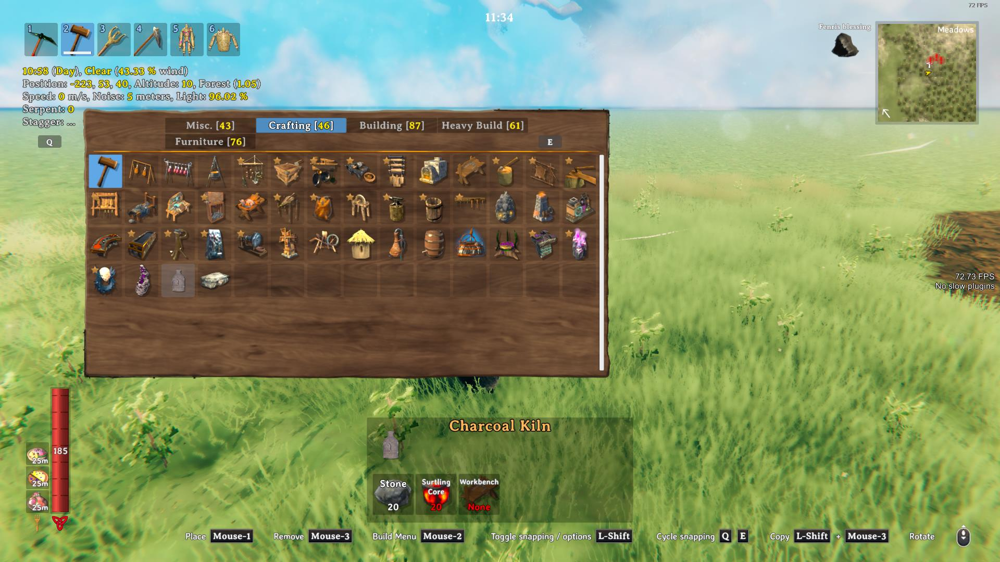
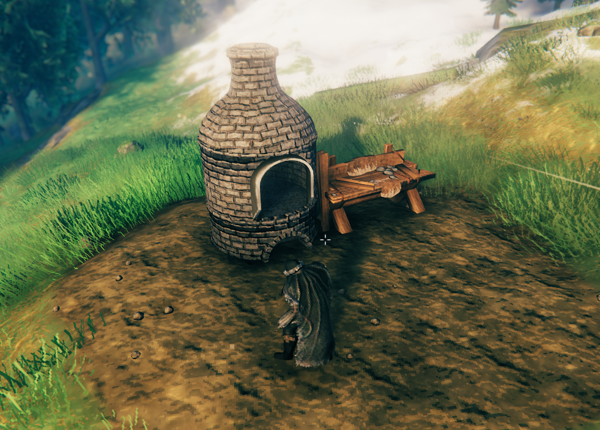
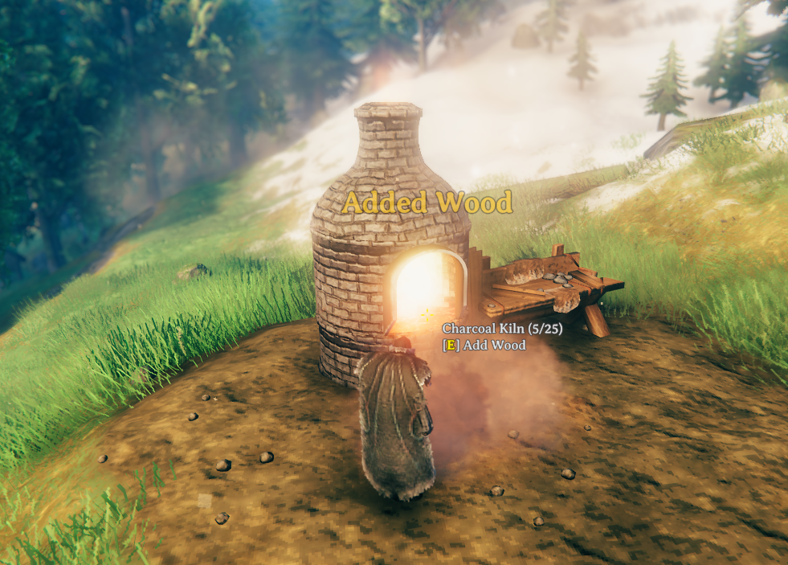

# KilnReimagined

---


https://valheim.thunderstore.io/package/Frogger/KilnReimagined/

Adds a new carbon-burning oven to replace the vanilla one.
All recipes are copied (from other mods too). <br>
But if you want, you can still use the old oven, it is still in the construction menu.

<details>
<summary><b><span style="font-weight:200;font-size:20px">
Config
</span></b></summary>

```
[General]

## Locks client config file so it can't be modified [Synced with Server]
# Setting type: Boolean
# Default value: true
ServerConfigLock = true

## <color=red>Requires full game restart</color> Remove the original Kiln from the hammer? [Synced with Server]
# Setting type: Boolean
# Default value: true
Remove Original From Hammer = true
```
</details>


### <ins>If something does not work for you, you have found any bugs, there are any suggestions, then be sure to write to me!</ins>

```My Discord:``` justafrogger <br>
```Neb Discord:``` Kai (Neb2566)#7625

### Commissioned by Neb

---

## Screenshots

<br>
<br>
<br>
